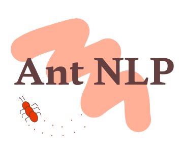
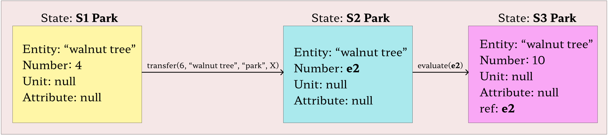

<p align="center">
  
</p>

# Ant-NLP
> Annotation-NLP (Ant NLP) is a text annotation tool that can be used to annotate math word problems using a graph based approach.

## What is Ant-NLP? 🤔
Annotation of text is crucial for NLP research, and while most tools involve highlighting text/labelling, sometimes a more niche approach is required. Ant-NLP helps annotate text, or more specifically - simple math word problems, by creating a graph data structure based visualization of the various states invovled in solving the problem. 

Sample word problem -
```
There are 4.0 walnut trees currently in the park. 
Park workers will plant 6.0 walnut trees today. 
How many walnut trees will the park have when the workers are finished?

- source: AllArith (Roy and Roth, 2018)
```

The graph that models this problem
<p align="center">
  
</p>

Here, the nodes represent the various states in the problem, while the edges represent some sort of action/evaluation on those states.  

The state parameter `unit` keeps track of specific units, while `attribute` keeps track of details regarding the entity. For example, if a problem contains the entity `ball`, then it's attribute could be `yellow` or `red`. This problem does not need these 2 parameters.

## Installation of Ant NLP from source 🚀

After cloning the repository to your local system, create a virtual environment, and activate it.

```
pip install virtualenv
virtualenv env
```

On Windows, powershell
```
.\env\Scripts\activate.ps1
```

On Mac/Linux
```
source ./env/bin/activate
```

Then install the required packages using the specified requirements.txt file
```
pip install -r requirements.txt
```

To launch the server and run the project,
```
python -m flask run
```

## Usage 💻

After launching the server, start a web browser and load the page with either of the below addresses -
```
http://127.0.0.1:5000/
http://localhost:5000/
```

